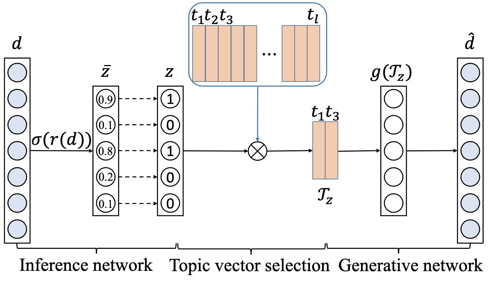

# WISH

Few-Bits Semantic Hashing

Code in Python for the paper "**Unsupervised Few-Bits Semantic Hashing with Implicit Topics Modeling**", Findings of EMNLP 2020. [[paper](https://www.aclweb.org/anthology/2020.findings-emnlp.233/)]

### Model

<p align="center">
  
</p>

### Train

1. Data Preprocessing

    ```
    python3 datapreprocessing.py
    ```
    
2. Training

   If the datasets have multiple labels for a single sample, run

   ```
   python3 train_WISH.py
   ```
    
   Otherwise, run

    ```
    python3 train_WISH.py --single_label_flag
    ```
    
### Citation

```bibtext
@inproceedings{ye2020unsupervised,
  title={Unsupervised Few-Bits Semantic Hashing with Implicit Topics Modeling},
  author={Ye, Fanghua and Manotumruksa, Jarana and Yilmaz, Emine},
  booktitle={Proceedings of the 2020 Conference on Empirical Methods in Natural Language Processing: Findings},
  pages={2566--2575},
  year={2020}
}
```
